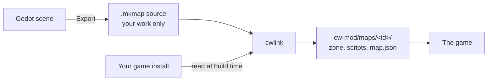

# Making a map: overview

> A custom Zombies map is laid out in Godot with the mapkit plugin, built with one button, and started from the game's CUSTOM MAPS tab. **Status:** Done for layout, gameplay, meshes, textures, sky and navmesh (2026-09-29). A map's own asset set and lighting are in progress.

## The six steps

1. **Set up once.** Godot, the plugin, the tools and a zone trace. See [Setup](/guide/mapping/setup.md).
2. **Lay out the map.** Boxes for a block-out, or your own models from Blender. See [Geometry](/guide/mapping/geometry.md).
3. **Place the Zombies objects.** Spawns, zones, doors, perk machines, the Mystery Box and the rest. See [Zones and spawns](/guide/mapping/zones-spawns.md) and [Gameplay objects](/guide/mapping/gameplay-objects.md).
4. **Check and walk it.** The Check button lists problems. F6 walks the map in first person at the game's speed and scale.
5. **Build.** The Build button exports the map's source and runs cwlink, which writes the game's files.
6. **Play.** Start the game, open Zombies, Private, CUSTOM MAPS, and pick your map.

New here? Follow [Your first map](/guide/mapping/first-map.md).

## What happens when you build

- The **source** (`.mkmap`) is a JSON file. It holds your geometry, your objects and their settings. Game assets appear in it by name only.
- **cwlink** turns the source into a zone the game can load, compiles the level scripts, and copies what the map needs from your own install.
- The **game** loads the map under its own name. Every PC in a lobby loads its own copy.

## What a map is made of today

| Yours | Still the game's |
|---|---|
| The layout and its collision | The zombies, their bodies and their behaviour |
| Your models and textures | The weapons, perks and machines |
| The sky, the sun, the fog | The effects and most sounds |
| Zones, spawns, doors, barriers | The ambient light and reflections, baked for Die Maschine's buildings |
| Where every machine stands | The picture in the menu and the loading screen |
| The navmesh zombies walk on | |
| The map's name and its level script | |

The full list, with what is copied and what is not possible yet, is on [What you can and cannot make](/guide/mapping/limitations.md). Read it before you plan a map.

## The rules

- A map holds only your own work. Never put files taken from the game into a map you share.
- The built zone is for your PC only. Others build it themselves from your source. See [Sharing a map](/guide/mapping/sharing.md).
- Close the game before you build: it keeps the map's files open.

<!-- sources: cw-mod mapkit/godot/README.md, mapkit/README.md, mapkit/mkmap-format.md, docs/mapkit-map-anatomy.md (sections 1 and 2), docs/ROADMAP.md (section 5) @ 36b1f18 + working tree, 2026-10-07 -->
