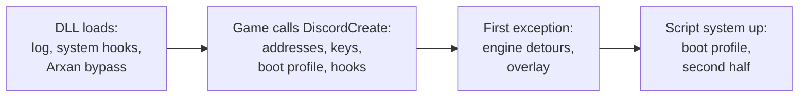

# The client: one DLL

> cw-mod's client is a single DLL that the game loads by itself. This page is the map: how it gets in, the order things start in, and where each part lives. **Status:** Done.

## In short

- The DLL is named `discord_game_sdk.dll`. The game loads that file from its own folder and calls its `DiscordCreate` export. That call is the mod's entry point.
- Nothing is patched on disk. Engine addresses are constants for build 1.34.0.15931218, moved to the live base at start.
- The protection is dealt with first, the engine is touched only after the game calls in, and engine detours go in at the game's first exception.
- Engine calls are made from one **game-thread tick**. The overlay only draws.

## The start, step by step

| Step | Where | What |
|---|---|---|
| 1 | `main.cpp`, `DllMain` | Identifies the game build by a checksum and starts the main thread |
| 2 | Main thread | Log service and console, crash logger, a copy of ntdll's debug functions, MinHook, the system hooks |
| 3 | A hook on `NtAllocateVirtualMemory` | The [Arxan](/re/client/arxan.md) bypass, while the game starts |
| 4 | `DiscordCreate` export | The game calls into the "SDK". First safe point to touch the engine. The DLL answers 1, "service unavailable". |
| 5 | `Pointers` constructor | Resolves anchors and signatures, swaps the backend's public keys in if they are present, picks the [boot profile](/re/client/boot-profile.md) and sets the network mode **before the menus are built** |
| 6 | `Hooks` constructor | Exception dispatch, single-instance mutex, input, the Demonware network hooks, and the tick |
| 7 | First exception through `RtlDispatchException` | Every engine detour, then the [overlay](/re/client/overlay.md) |
| 8 | A thread waiting for the script system | The second half of the boot profile |

## The game-thread tick

Engine functions must be called on the game's own thread. The mod has no thread there, so it borrows a call the game makes every frame.

1. The game reads one debug dvar every frame through `Dvar_GetBool`.
2. The mod replaces that dvar's pointer with the value `1`.
3. `Dvar_GetBool` then faults at a known compare instruction, with `1` in `rcx`.
4. The mod's hook on `RtlDispatchException` sees the fault at that instruction, puts the real pointer back in `rcx`, runs its callback, and continues the game.

The callback, `OnShowOverStack`, is the tick. It runs the actions the overlay queued, then each feature's per-frame work: the LAN browser, the local playlists, the map loader, the menu scripts, progression.

## Where things live

| Folder | Holds |
|---|---|
| `client/arxan/` | The Arxan bypass and its system hooks |
| `client/game/` | Everything that reaches into the game: `Pointers`, the address table, settings, the boot profile, and one file per feature |
| `client/hooks/` | One file per hooked function under `impl/` |
| `client/memory/` | Signature scanning, the MinHook wrapper, import-table hooks |
| `client/overlay/` | The D3D12 hook and the menu, one file per tab |
| `client/scripting/` | The GSC script loader |
| `common/` | Logging and utilities with no game knowledge |

## The crash logger

A vectored exception handler, **appended** to the chain so that it only sees what nothing else claimed. Arxan raises and handles exceptions on purpose; a handler that ran first would drown in them.

| It does | Detail |
|---|---|
| Logs | The exception code, the faulting address as `module+offset`, four registers |
| "Stack trace" | Scans the stack for values that point into a loaded module. It needs no debug library, which Arxan is hostile to. |
| Skips | Faults raised inside the mod's own guarded memory probes, and two faults that happen on every healthy run |
| Never changes anything | It always passes the exception on |

## Two rules of the code base

- **Every read of a reverse-engineered layout is guarded.** `SafeRead` and `SafeCopy` turn a wrong offset into a log line instead of a crash.
- **The overlay never calls game code.** A button queues a closure; the tick runs it on the game thread.

## Limits

- Tied to one build. On another, anchors fail their bounds check or point at the wrong code.
- The tick depends on the game reading that dvar every frame.

## See also

- [Arxan](/re/client/arxan.md), [Hooking](/re/client/hooking.md), [The boot profile](/re/client/boot-profile.md), [The overlay](/re/client/overlay.md)
- [Install](/guide/install.md): the player's side

<!-- sources: cw-mod docs/ARCHITECTURE.md, client/main.cpp, client/hooks/hook.cpp, client/hooks/hook_types.hpp (EventHandlerStore), client/hooks/impl/game/RtlDispatchException.cpp, client/hooks/impl/events/show_over_stack.cpp, client/game/game_internal.hpp, CONTRIBUTING.md @ 36b1f18 + working tree, 2026-10-08 -->
