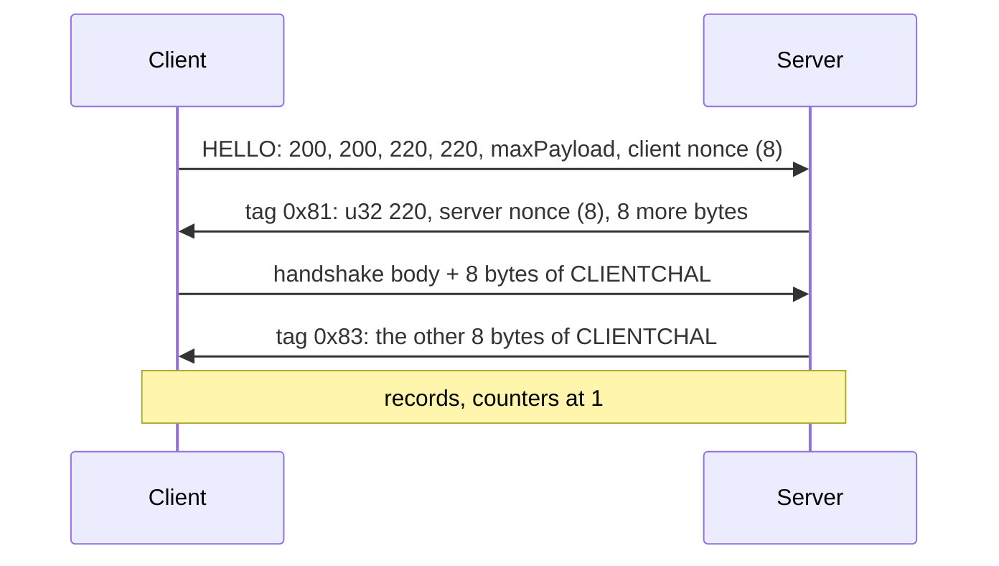

# The LSG connection

> After auth the client opens one TCP connection, proves both sides hold the same session key, and from then on sends everything as encrypted records. This page gives the handshake, the key schedule, the record layout and the timer that silently killed the connection every two minutes. **Status:** Done, in game. Client records decrypted with matching checksums over seven logins in a row (2026-08-01).

## In short

- Port **3074**, fixed inside the client. The auth reply supplies only the host.
- The handshake is four messages. Its secret is the 24-byte session key the auth server put in both tickets, so there is nothing to break: the server already knows it.
- Every later message is a record: AES-128-CBC with an 8-byte truncated HMAC-SHA1, and a counter that starts at **1**.
- The client drops the connection 120 seconds after the **server** last sent a byte. Its own keepalives do not count.

## Framing

| Direction | Form |
|---|---|
| Client HELLO | 28 raw bytes. No length, no tag. |
| Every server message | `[u32 N][0xAB][tag][payload]`, with `N = len(payload) + 2` |
| A keepalive, both ways | `00 00 00 00`: a length of zero and nothing else |

The client's receive loop reads 4 bytes as `N`, drops the connection if `N` is above the maximum payload, idles if `N` is 0, then reads one byte (the `0xAB`) and `N - 1` more (the tag and the payload).

## The handshake



| Message | Detail |
|---|---|
| HELLO | `Lsg_SendHello` writes five little-endian u32 and the nonce. The two 220s are where the folklore "magic 0xDCDC" comes from. |
| 0x81, server challenge | The client checks the 220 and stores the server nonce. The last 8 bytes are not parsed but **are hashed**, so the server must remember what it sent. |
| Client reply | The body, then 8 bytes derived from the session key. The 8 bytes are appended **after** hashing: "everything but the last 8" is what was hashed. |
| 0x83, login OK | The server echoes the 8 CLIENTCHAL bytes the client derived and **kept**. A wrong echo is an instant disconnect with no message. |
| 0x84 | Reject |

## The key schedule

```text
scratch = u32 220, u32 220, u32 maxPayload
          client nonce (8)
          u32 (n + 2), 0xAB, 0x81, the n bytes of the server challenge's payload
          the client's handshake body (its frame minus the last 8 bytes)

digest  = SHA1(scratch)
prk     = HMAC-SHA1(key = digest, msg = session key)        <- note the order
chal    = KDF(prk, "CLIENTCHAL", 16)       [0:8] sent, [8:16] kept
bd      = KDF(prk, "BDDATA", 72)
```

`bd` splits into the four record keys:

| Bytes | Key |
|---|---|
| 0 to 19 | HMAC key, client to server |
| 20 to 39 | HMAC key, server to client |
| 40 to 55 | AES-128 key, client to server |
| 56 to 71 | AES-128 key, server to client |

The KDF is SP800-108 in **feedback** mode with HMAC-SHA1:

```text
K1 = HMAC(key, label || 0x01)
Ki = HMAC(key, K(i-1) || label || i)
```

No zero byte between label and counter, no length suffix. Both are common in textbook profiles and neither is here.

| Trap | Detail |
|---|---|
| HMAC operand order | The key is the **digest**; the message is the session key. Written the usual way round it gives 20 plausible bytes that never match. |
| The client hashes a scratch buffer | It is assembled apart from the frame it sends, so the hashed range cannot be read off the wire format |
| The optional "wrap" | A branch stretches the session key first, with the embedded [LSG public key](/re/dwemu/keys.md) as the KDF **label**. Measured: this build does not take it. |

## The record layer

After 0x83, each message in either direction:

| Offset | Size | Field |
|---|---|---|
| 0 | 4 | `N = ctlen + 30` |
| 4 | 1 | `0xAB` |
| 5 | 1 | `0x85` |
| 6 | 4 | Counter. Starts at **1** each way. |
| 10 | 16 | Random IV |
| 26 | `ctlen` | AES-128-CBC of `u32 innerLen, u8 innerTag, body, zero padding` |
| 26 + `ctlen` | 8 | HMAC-SHA1, first 8 bytes |

`ctlen = (innerLen + 20) & ~15`.

| Trap | Detail |
|---|---|
| What the HMAC covers | The whole frame except the 8 MAC bytes: `frame[0 : N - 4]`, **including** the length and the `0xAB`. Starting at the `0x85` fails with "HMAC mismatch". |
| The counter | Both sides are set to 1 when the handshake is accepted. A 0 is rejected as "Bad recv counter". |
| The padding | Zeros to a multiple of 16, not PKCS#7. The true length is the encrypted u32. |

The error strings quoted here are the engine's own. They are the best guide in the protocol: the server's parser raises with the same texts.

The **inner tag** says what the record carries. See [The lobby protocol](/re/dwemu/lobby-protocol.md).

## The 120-second timer

Found on a long session: the client closed the connection exactly 120 seconds after the last bytes the server had sent, logged `[status 25]`, and ran the whole login again. Eight times in thirty minutes.

- The client sends its own zero-length keepalive about every 40 seconds.
- `Lsg_PumpRecv` restarts a "last received" stopwatch on any read of more than 0 bytes. Only **incoming** bytes reset it.
- A bare length prefix is 4 bytes. So the server now answers each keepalive with one of its own. No record counter is used.

Passed 2026-09-16: one connection for 4.5 minutes, six echoes, no `[status 25]`.

## Functions

| Name | RVA | IDA address | Role |
|---|---|---|---|
| `Lsg_ConnectTask_Ctor` | 0xD231140 | 0x7FF729DF1140 | Sets the port to 3074. Nothing ever changes it. |
| `Lsg_ConnectTask_BeginResolve` | 0xD231BE0 | 0x7FF729DF1BE0 | Takes the host from the auth reply, as it is |
| `Lsg_SendHello` | 0xD228940 | 0x7FF729DE8940 | The 28 bytes |
| `Lsg_BuildHandshake_ParseBDDATA` | 0xD227050 | 0x7FF729DE7050 | The key schedule |
| `Crypto_KdfCounterMode` | 0xD17A560 | 0x7FF729D3A560 | The KDF |
| `Lsg_SendEncryptedMessage` | 0xD228D60 | 0x7FF729DE8D60 | Builds a record |
| `Lsg_OnEncryptedMessage` | 0xD227780 | 0x7FF729DE7780 | Checks and decrypts a record |
| `Lsg_RecvLengthPrefix` | 0xD2286A0 | 0x7FF729DE86A0 | Reads `N`. Idles on 0. |
| `Lsg_PumpRecv` | 0xD228470 | 0x7FF729DE8470 | The receive pump and its stopwatch |
| `Lsg_ErrorCodeToString` | 0xD195E90 | 0x7FF729D55E90 | Returns "HIDDEN" for every code. Only the number means anything. |
| `Lsg_Task_GetErrorCode` | 0xD1AB720 | 0x7FF729D6B720 | Where that number comes from |

## How we found it

- **Framing, the hard way.** A challenge sent with no length prefix made the client read `81 dc 00 00` as a length of 56,449 and wait for bytes that never came. Sent without the `0xAB`, it waited for one byte more. The rule that came out: a **stall** means "waiting for bytes", an **instant** failure means "rejected".
- **The hashed range.** Not guessed per start. The server recorded one client frame and tried every reading offline until one reproduced the 8 challenge bytes. That pinned the range and the "wrap" flag in one go.
- **Our own disconnects.** Three times a "client disconnect" was the server's own socket closing after a timeout. The server now holds a session for 15 minutes, so anything that ends it is the client's doing.
- **The keepalive.** A 4-byte frame with length 0 was first treated as malformed.

## Limits

- One session key per login, minted by the auth server and handed over through a file. The LSG server takes the newest.
- The "wrap" branch is implemented and never used.

## See also

- [Auth](/re/dwemu/auth.md): where the session key comes from
- [The lobby protocol](/re/dwemu/lobby-protocol.md): what is inside a record
- [The server](/re/dwemu/server.md): `lsgserver.py`, `lsgcrypto.py`, `lsgtest.py`

<!-- sources: cw-mod tools/dwserver/lsgcrypto.py, lsgserver.py, authserver.py (LSG_PORT note), docs/backend-roadmap.md (B2, the keepalive), .claude/skills/bocw-reverse-engineering/SKILL.md (section 9) @ 36b1f18 + working tree, 2026-10-08 -->
