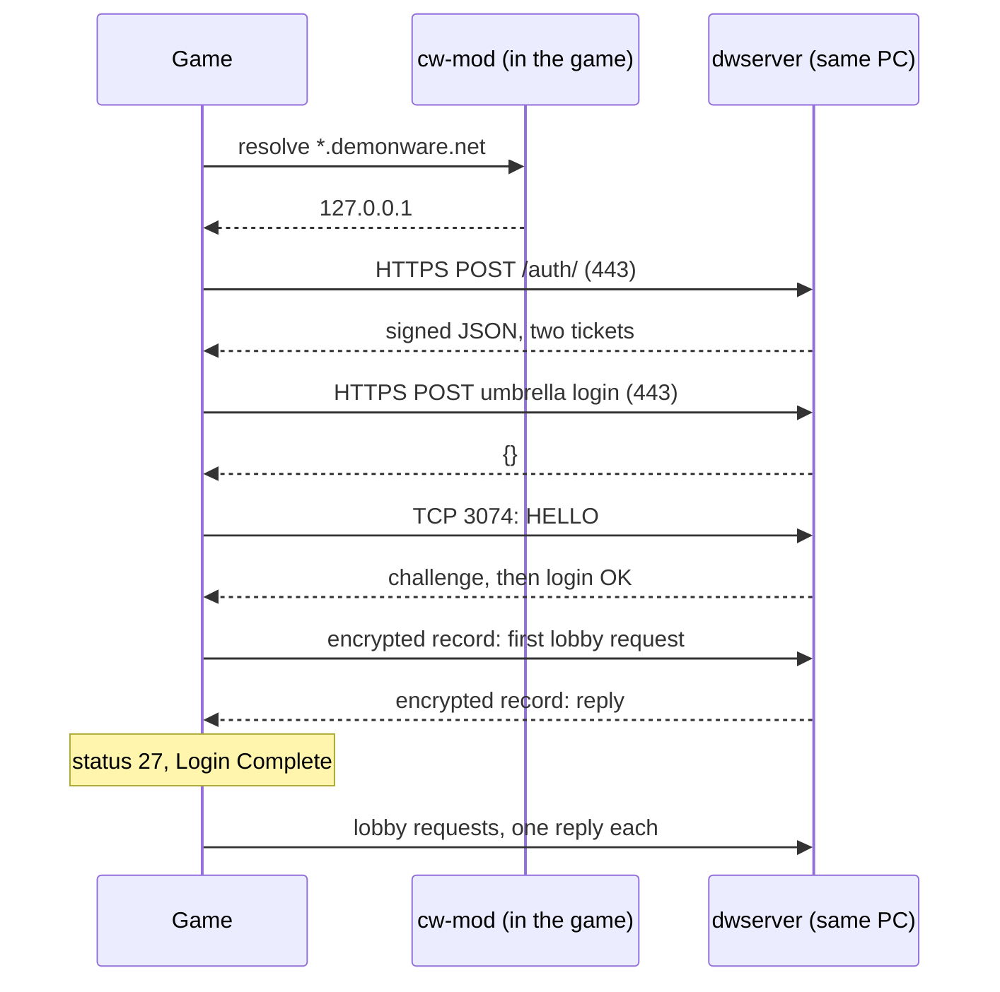

# DWEmu: a local Demonware

> Demonware is the online service behind the game: login, storage, playlists, the store. DWEmu is cw-mod's own copy of the part the game cannot start without, run on the player's PC. This page is the map of the whole chain. **Status:** Part done. Login, the online party, playlists and a two-PC online match are done (2026-09-29). The store and the marketplace are not planned.

## In short

- The game signs in to Demonware in stages. Each stage checks something only the real service could produce, with a key that is **inside the game**.
- Because the keys are in the client, nobody needs Demonware's private keys. cw-mod makes its own key pairs, swaps its public keys into the running game, and signs with its own private keys.
- Two halves: hooks in the client DLL, and a small Python server (`tools/dwserver`) on the same PC.
- A Demonware name can never reach the internet: the client answers it from loopback, or refuses it.

## The chain

| # | Stage | Port | What the client checks | Page |
|---|---|---|---|---|
| 1 | Name resolution | | Nothing | [Redirect and TLS](/re/dwemu/redirect-tls.md) |
| 2 | TLS | 443 | The certificate chain **and its revocation**, through Windows | [Redirect and TLS](/re/dwemu/redirect-tls.md) |
| 3 | Auth | 443 | An RSA-PSS signature over the reply, then each field | [Keys](/re/dwemu/keys.md), [Auth](/re/dwemu/auth.md) |
| 4 | Umbrella login | 443 | That the reply is a JSON object | [Auth](/re/dwemu/auth.md) |
| 5 | LSG handshake | 3074 | That the server holds the session key | [The LSG connection](/re/dwemu/lsg.md) |
| 6 | First lobby request | 3074 | The reply's tag, then its fields | [The lobby protocol](/re/dwemu/lobby-protocol.md) |
| 7 | Everything after | 3074 | One reply per request, in order | [The service router](/re/dwemu/router.md) |

After stage 6 the game still does not open its online menus. That is a client-side story: see [After login](/re/dwemu/post-login.md).

## The client side

| What | How | Page |
|---|---|---|
| Send Demonware names to loopback | Import-table hooks on `getaddrinfo`, `gethostbyname`, `connect` | [Redirect and TLS](/re/dwemu/redirect-tls.md) |
| Trust our signatures | Overwrite two 294-byte public keys in the image | [Keys](/re/dwemu/keys.md) |
| Skip the Battle.net step | `Dw_GetLoginFlow` answers 9, "studio auth" | [Auth](/re/dwemu/auth.md) |
| Supply a login token | Replace the token `DwLogin_BuildStudioToken` cannot build | [Auth](/re/dwemu/auth.md) |
| Let the login start and post-login run | The first-party presence gate | [After login](/re/dwemu/post-login.md) |
| Mirror the login's own status lines | A read-only detour on `Login_SetStatus` | [The server](/re/dwemu/server.md) |

Everything here is installed only when the backend is on: `"backend": true` and the two public key files in `<game>\cw-mod\dwserver\`. Without them the game is byte-for-byte as it was.

## Where it stands

| Stage | Seen in the game |
|---|---|
| Redirect, local certificate authority, TLS | Yes |
| Auth, umbrella, LSG handshake, record layer | Yes |
| First reply accepted, `[status 27] Login Complete` | 2026-08-02 |
| A stable online start, first post-login requests | 2026-09-16 |
| Online party, playlists, Zombies lobby, match start | 2026-09-24 |
| Two PCs in one online match, each with its own backend | 2026-09-29 |

| Not there | Why |
|---|---|
| The marketplace inventory and the store | They wait on a Battle.net token no server reply can supply |
| Demonware user storage | Saves are kept local instead. See [PlayerData](/re/engine/playerdata.md). |
| Public matchmaking, dedicated servers, NAT traversal | Out of scope. Peers connect directly. See the netcode section. |
| The achievement service | The client stands in for its data. See [Progression](/re/engine/progression.md). |

## Rules of this section

- An **offline test that passes is never enough**. Each stage counts as done only when the game's own log line says so.
- Everything runs on the player's own PC, for a game they own. Retail servers are never a target, and the redirect makes that a property of the code, not a promise.
- No key or certificate appears in these pages. Each player generates their own.

## See also

- [Online mode, the guide](/guide/play/online.md): how to run it
- [dwserver, the tool page](/guide/tools/dwserver.md)
- [The story](/re/dwemu/story.md): the milestones in order, with the wrong turns

<!-- sources: cw-mod docs/backend-roadmap.md, docs/re/demonware-login.md, tools/dwserver/README.md, client/game/dw_backend.cpp, dw_net.hpp, client/hooks/hook.hpp, docs/ROADMAP.md (section 3) @ 36b1f18 + working tree, 2026-10-08 -->
