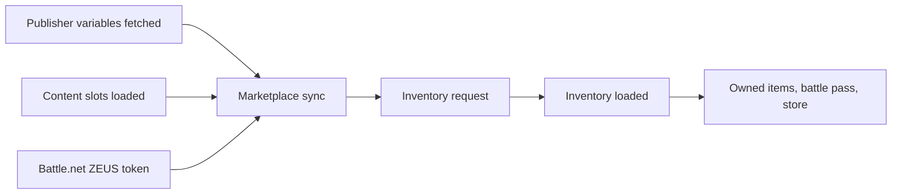

# Storage, the store and entitlements

> What Demonware would normally keep for the player (saves, owned items, the battle pass) and what happens to each on the local backend. Most of this page is the reasoned list of what is **not** emulated. **Status:** Part done. Saves are local. The marketplace inventory and the store are not planned.

## In short

- **Saves:** kept on the PC. The backend stores nothing. See [PlayerData](/re/engine/playerdata.md).
- **Level and weapon levels:** kept by the client in a local file, in place of Demonware's achievement service. See [Progression](/re/engine/progression.md).
- **Owned items:** all one thing, "the quantity of item N in the marketplace inventory". The inventory cannot load here: it waits on a Battle.net token.
- **The mode-tile padlocks** were never an ownership check. They were a missing party.
- For ownership, cw-mod does not fake an inventory. One setting answers the ownership **questions** instead. See [Unlock-all](/re/engine/unlock-all.md).

## Why the inventory never loads

| Step | Function | Needs | Here |
|---|---|---|---|
| Sync may start | `MtxSync_ShouldStart` | Its dvar on, the user online-ready, publisher variables ready, state 0, a back-off timer | Passes |
| Ask for a token | `MtxSync_BeginBnetTokenRequest` | The first-party layer returns a Battle.net token of kind `ZEUS` | **Never.** There is no Battle.net sign-in, and no server reply can supply a token the client asks Battle.net for. |
| Inventory fetch | `Inventory_Frame` | The sync in flight or done, both content slots loaded, a per-user field set, the online save maps ready | Not reached |

Measured on every backend start, from the client's heartbeat line: sync state 1, inventory state 1, 0 items.

| Global | Layout | Values |
|---|---|---|
| `g_mtxSyncState` | int per controller | 0 idle, 1 waiting for the token, 2 sync sent, 3 done |
| `g_inventory` | 801,056 bytes per controller | State at `+400956`: 0 never reset, 1 request, 2 in flight, 3 next page, 4 loaded, 5 retry. Item count at `+400948`. Loaded flag at `+944`. |
| `g_pubVarsState` | int | 2 fetching, 3 failed, 4 ready |

The inventory is bit R of the [menu checklist](/re/dwemu/post-login.md), where it is waived.

## What reads the inventory

| Thing | How it reads | Without an inventory |
|---|---|---|
| Blueprints, bundles, operators | `Inventory_GetItemQuantity`, `Loot_GetItemQuantity` | Not owned |
| `Engine.HasEntitlement` | `Entitlement_IsOwned`: owned if one of the product's ids has a quantity above 0 | Not owned |
| The battle pass | 8 bytes per season in the user's loot block: owned, tier, XP. The getters return 0 until the inventory is ready. | Not owned, tier 0 |
| The store | Built in Lua from two tables in the game's own zones: every item with its price, and a schedule of rows with a start and end time. An owned item is left out. | Lists whatever rows are in their time window |
| "Trial" (the upsell on the tiles) | `LiveUser_IsTrial`: a Battle.net license list | Answered by its own [detour](/re/dwemu/post-login.md) |

Two details about the battle pass:

- Its tier and XP have **one** writer: an event pushed by Demonware's achievement service. The server works out battle pass XP; player level does not feed it.
- The XP each tier needs is client data, a table in the game's files.

## The decision: answer, do not store

A local inventory was considered and rejected (2026-10-07). It could not tell a bought item from one that was not: it would own whatever its file lists.

So ownership is one opt-in setting on the client, which answers the predicates above and writes nothing. Turn it off and every answer is the real one again.

## The padlocks: a case of the wrong suspect

The roadmap's first plan for the locked mode tiles was entitlements: find what the census shows, serve it, unlock.

| Finding | Source |
|---|---|
| With a detour armed on `Entitlement_IsOwned`, a start with locked tiles asked it **nothing** | Measured, in one of the project's forks |
| Offline the tiles unlock about 2 seconds after the menu opens, when a "lobby leader activity" event fires | Measured |
| Online that event never fired: no lobby existed | Measured |
| The tile's lock in Lua is "I am not the host of a private party" | Read from the menu's Lua |

The fix was on the client and had nothing to do with ownership. See [After login](/re/dwemu/post-login.md), wall 6.

## Saves

| Kind | Where it lives now |
|---|---|
| The game's data maps (stats, loadouts, progression) | Local `.cgp` files, through the [storage redirect](/re/engine/playerdata.md) |
| The level block | A local file kept by the client |
| A per-user profile blob the client fetches after login | Nowhere. The server answers "not found" and the client uses defaults. See [The service router](/re/dwemu/router.md). |

Server-side user storage is not planned. With it, the redirect on the client could go.

## Functions

| Name | RVA | IDA address | Signature | Role |
|---|---|---|---|---|
| `MtxSync_ShouldStart` | 0x1B8DE40 | 0x7FF71E74DE40 | | The sync's start conditions |
| `MtxSync_BeginBnetTokenRequest` | 0x1B90420 | 0x7FF71E750420 | | Asks Battle.net for the `ZEUS` token |
| `MtxSync_OnBnetToken` | 0x1B90600 | 0x7FF71E750600 | `u8 (i32 error, i64* token)` | Would continue the sync |
| `MtxSync_IsDoneOrInFlight` | 0x1B8DCB0 | 0x7FF71E74DCB0 | | What the inventory waits on |
| `Inventory_Frame` | 0xB35D5E0 | 0x7FF727F1D5E0 | | Fetches the inventory, page by page |
| `Inventory_GetItemQuantity` | 0xB35B3E0 | 0x7FF727F1B3E0 | `u64 (int controller, uint itemId)` | The ownership read |
| `DwFetch_IsInventoryReady` | 0xB35B990 | 0x7FF727F1B990 | `bool (uint controller)` | Gates 13 loot functions |
| `Entitlement_IsOwned` | 0xB953340 | 0x7FF728513340 | `char (int controller, u64 nameHash)` | Behind `Engine.HasEntitlement` |
| `Loot_GetBattlePassRank` | 0xAD414F0 | 0x7FF7279014F0 | `u64 (uint controller, int season)` | 0 until the inventory is ready |
| `g_mtxSyncState` | 0xE5B3420 | 0x7FF72B173420 | int[2] | |
| `g_inventory` | 0x16FB9520 | 0x7FF733B79520 | | |
| `g_pubVarsState` | 0x174BBAF4 | 0x7FF73407BAF4 | int | |
| `dvar_mtxSyncEnabled` | 0x1A616B18 | 0x7FF7371D6B18 | pointer slot | With it off, the sync counts as done and never starts |

## Limits and open points

- Which store rows are active today was not read.
- A test built in a fork and never run: turn the sync dvar off, so the sync counts as done and the first inventory request shows up in the census. That would show what the inventory request and its reply look like.
- The `extended_data` field of the [auth reply](/re/dwemu/auth.md) is stored by the client and is account-scoped. What reads it is not known.

## See also

- [Unlock-all](/re/engine/unlock-all.md)
- [Progression](/re/engine/progression.md), [PlayerData](/re/engine/playerdata.md)
- [After login](/re/dwemu/post-login.md)

<!-- sources: cw-mod docs/backend-roadmap.md (B4, B5), docs/fork-findings.md (sections 1 to 3), client/game/dump_anchors.hpp (B5 notes, MtxSync, unlock_all section), client/game/session.cpp (EntitlementGates), tools/dwserver/lobby_router.py @ 36b1f18 + working tree, 2026-10-08 -->
