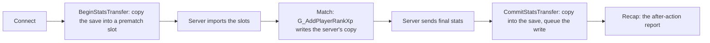

# Progression: XP, levels and the save

> Outside an online public match the game earns nothing: no XP is added, not even in memory, and nothing is saved. This page lists the gates, where the level really lives, and what the client does so the engine records and saves by itself. **Status:** Done offline and in LAN mode (2026-09-23). Online: level and weapon levels passed 2026-10-07; the match-end save of the progression file has a fix that is built and not yet run.

## In short

- Two predicates decide whether a match counts. In Zombies both need network mode 2 and a match type other than "custom".
- The progression data maps are on Demonware storage. See [PlayerData](/re/engine/playerdata.md).
- The **player level and weapon levels are not in the save file** at all. They live in a block that Demonware's achievement service fills, `ae_sync`.
- cw-mod opens the gates, keeps the maps on disk, and stands in for that block with a local file. It computes no stat: the engine does all the counting.

## The gates

| Gate | Rule | Who asks |
|---|---|---|
| `LiveStorage_AreMatchStatsEnabled` | `forceDvar or (zm and networkMode == 2 and matchType != 1)` | 11 callers: all rank XP, weapon XP, weapon stats, the match-start copy, the match-end commit |
| `GScr_AreStatWritesEnabled` | The same, and a kill-switch dvar | The 7 script stat-write helpers |

`G_AddPlayerRankXp` is where every XP source lands. It returns early unless: stats are not disabled by script, the first gate is true, stat writes are allowed, and the server has the player's stats slot.

## One match, as the engine runs it

The transfer record is `g_statsTransfer`, 528 bytes per controller:

| Offset | Type | Meaning |
|---|---|---|
| +176 | DDL instance | Source 2 (the level block), as it was before the match |
| +416 | DDL instance | Source 2, current |
| +480 | int[2] | Data map id per source: 19 for Zombies, 5 common |
| +492 | u8 | Record valid |
| +498 | u8[2] | Committed, per source |
| +501 | u8[2] | Signature arrived, per source |
| +504, +508 | int | Game mode, network mode |
| +520 | u64 | XUID |

`LiveStorage_CommitStatsTransfer` returns **silently** when: already committed, the record is invalid, the gate is false, the save's `player_xuid` is not the signed-in XUID, the buffer is not ready, or the copy failed. The copy is the **whole buffer**, not a difference.

## Where the level lives

`ae_sync` is a DDL instance of 5,120 bytes, reached through the user object: `LiveUser + 40024`, then `+18328`.

| In it | Read by |
|---|---|
| `progression.base_xp` | The menus' rank, the after-action report, the server's XP counter |
| `progression.weapons[w].xp` | Weapon levels and attachment unlocks |
| `weapon_challenges`, `attachment_challenges` | Camos |

- The block is created only on a Demonware sign-in. Offline and in LAN it is null and the level reads 0.
- The server seeds its XP counter from the client's copy of this block. With no block every match started at 0, and the match's total then overwrote the saved `rankxp`: the save never grew.
- On an online boot the local backend creates it **blank**: it has no achievement service. So the level was 1 at every start.

## What cw-mod does

| # | What | Detour | Detail |
|---|---|---|---|
| 1 | Opens the gates | Both gate functions | Answer true in a Zombies session. Each changed call site is logged once. |
| 2 | Keeps the maps local | [The storage redirect](/re/engine/playerdata.md) | Maps 5, 18 and 19 |
| 3 | Stamps the save | `LiveStorage_BeginStatsTransfer`, `CommitStatsTransfer` | Writes the local XUID into `player_xuid`. A default buffer has 0, and the engine's own stamp runs only on a Demonware sign-in. |
| 4 | Guards the save | The same two | If the match-start copy fails, the copy runs again unforced so the match loads, and that controller is marked: its commit is skipped. Otherwise a blank buffer would overwrite the real save. |
| 5 | Stands in for the level block | `LiveStats_GetLiveUserStatsInstance`, `LiveStats_GetAeRootStateSlot`, `Lua_PushAeSyncBuffer` | A local `ae_sync` instance, kept in `cwmod_ae_sync_<n>.bin`. Its `base_xp` mirrors the saved `rankxp`. |
| 6 | Seeds the server | `G_AddPlayerRankXp`, `SV_ClientStatsReady` | Raises the server's counter to the saved XP, and backs the server's source-2 slot with the local block so weapon XP has somewhere to go |
| 7 | Feeds the report | After the final commit | Fills the record's two source-2 instances and raises the three model flags the report waits on |
| 8 | Shows the progression menus in LAN | `LobbyRoot_SetNetworkModeModel`, `Lua_GameModeIsMode_Impl` | The menus read a **model** of the lobby's network mode, not the engine's value: LAN is shown to them as LIVE. And the two Create-a-Class gates are told a LAN lobby is not a custom game. The engine stays LAN. |

On an online boot the engine's own block exists, so step 5 changes: the client copies the local block into the engine's once per creation, keeps its XP at the saved value, and saves it back at match end. Measured 2026-10-07: an online private Zombies match passes both gates by itself (match type 0).

The player folder is copied to a backup once per start.

## Functions

| Name | RVA | IDA address | Signature |
|---|---|---|---|
| `LiveStorage_AreMatchStatsEnabled` | 0xAA03DA0 | 0x7FF7275C3DA0 | The match-stats gate |
| `GScr_AreStatWritesEnabled` | 0x5E4E2D0 | 0x7FF722A0E2D0 | Its sibling for script stat writes |
| `G_AddPlayerRankXp` | 0x70238F0 | 0x7FF723BE38F0 | `u64 (i16 clientNum, i64 xp, i64 xpType, u64 eventHash)` |
| `LiveStorage_BeginStatsTransfer` | 0x875A310 | 0x7FF72531A310 | `char (int controller)` |
| `LiveStorage_CommitStatsTransfer` | 0x8760000 | 0x7FF725320000 | `u64 (int controller, int source, uint checksum, char final)` |
| `Ddl_CopyInstanceToInstance` | 0x8760A90 | 0x7FF725320A90 | The only stats mover |
| `SV_ClientStatsReady` | 0x7058230 | 0x7FF723C18230 | `char (u8* svClient)` |
| `SV_GetClientStatsInstance` | 0x7019720 | 0x7FF723BD9720 | `void* (i16 clientNum, int source)` |
| `LiveStats_GetLiveUserStatsInstance` | 0x9EBD380 | 0x7FF726A7D380 | `void* (int controller)` |
| `LiveStats_GetXp` | 0x9EBD710 | 0x7FF726A7D710 | `uint (void* instance, uint season)` |
| `LiveStats_SetXp` | 0x9EBF100 | 0x7FF726A7F100 | `bool (void* instance, uint season, int xp)` |
| `Rank_GetLevelForXp` | 0xAD44DC0 | 0x7FF727904DC0 | `int (int xp)` |
| `LiveStorage_LuiAarRecap` | 0x87613C0 | 0x7FF7253213C0 | Hands six instances to the report's Lua |
| `LobbyRoot_SetNetworkModeModel` | 0xB1EF360 | 0x7FF727DAF360 | `u64 (int mode)` |
| `Lua_GameModeIsMode_Impl` | 0x98CAA40 | 0x7FF72648AA40 | `u64 (void* L, int mode)` |
| `g_statsTransfer` | 0x1126E650 | 0x7FF72DE2E650 | 528 bytes per controller |

Server client: 70,864 bytes each, `rankxp` at `+54188`, stats slot states at `+53788`, one 64-byte instance per source from `+53808`.

## How we found it

- Forcing the gate dvar alone made every connect fail with a three-word error: the match-start copy took its real-copy branch and the copy failed.
- XP was earned in a match and the level stayed 0. The level is not `rankxp`: every reader goes to `ae_sync`.
- `Ddl_InitInstance` has seven arguments. Called through the four-argument [thunk](/re/client/arxan.md), its fifth became a callback, and the next XP write jumped to a heap address at map load.

## Limits and open points

- **Open, online boots.** The match-end copy into maps 19 and 5 was refused on 2026-10-07. The save had been made under another XUID, and the client's stamp did not take: the engine marks a progression map **read-only** once its file has loaded (DDL instance `+28`: 1 writable, 2 read-only). The fix sets the mode for that one write, the way the engine does for its own. Built, not run.
- Seven Zombies rewards are read by the menus straight from the save.
- A match that started from a blank buffer is not saved, on purpose.

## See also

- [Saves and progression, the guide](/guide/play/progression.md)
- [PlayerData](/re/engine/playerdata.md), [Unlock-all](/re/engine/unlock-all.md)
- [Function index](/re/reference/functions.md): the group "PlayerData, stats and progression"

<!-- sources: cw-mod client/game/zm_progression.hpp, client/game/dump_anchors.hpp (ZM progression, AE block, gun XP, AE on an online boot, LIVE menus), client/hooks/hook.hpp, docs/ROADMAP.md (section 4), .claude/skills/bocw-reverse-engineering/SKILL.md (section 9) @ 36b1f18 + working tree, 2026-10-08 -->
